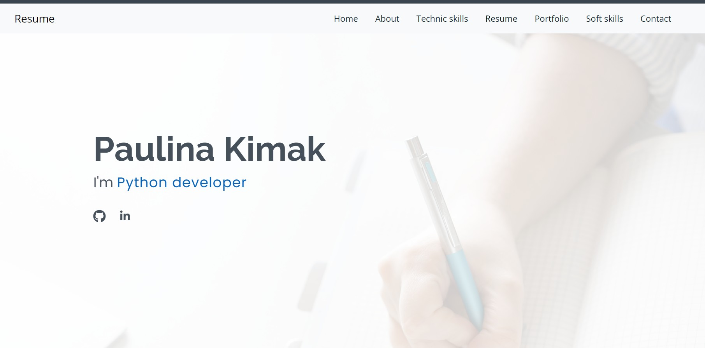
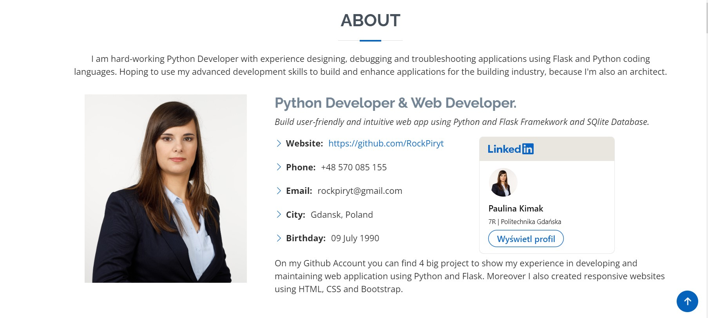
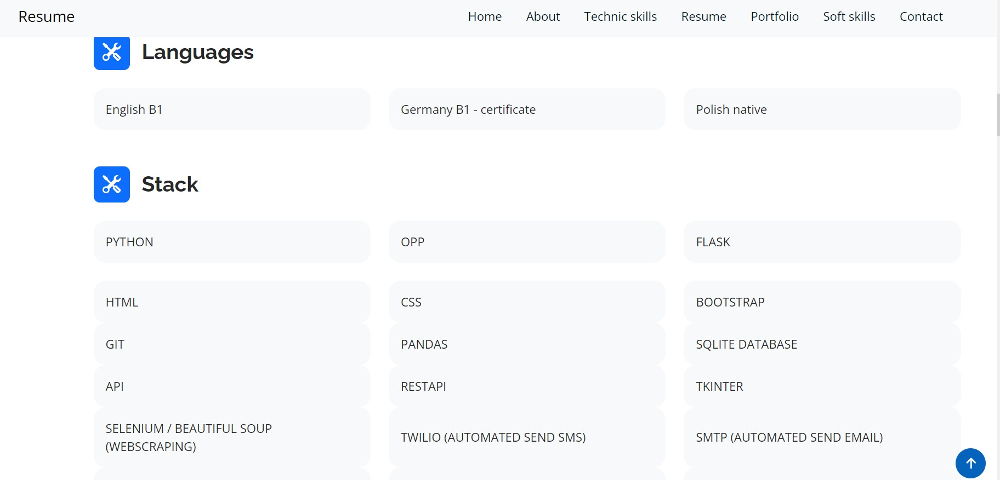
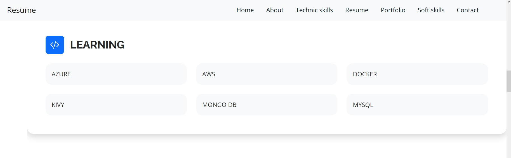
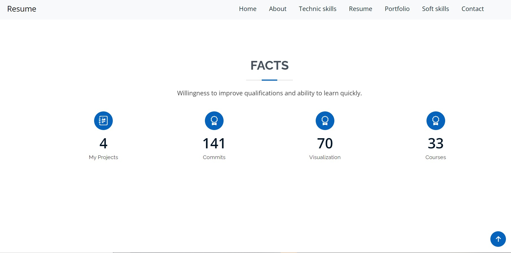
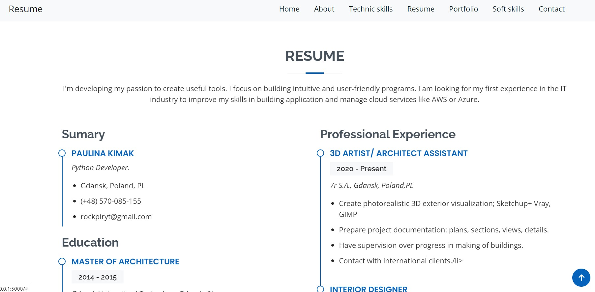
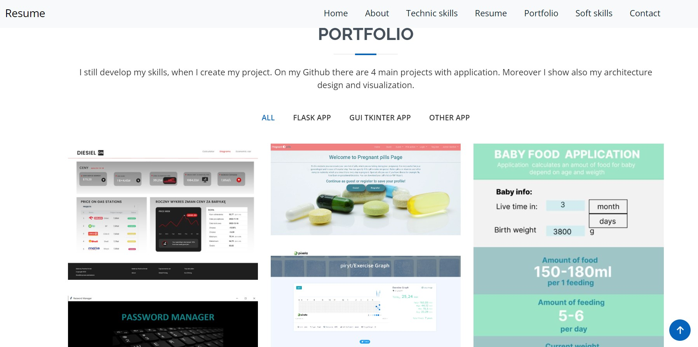
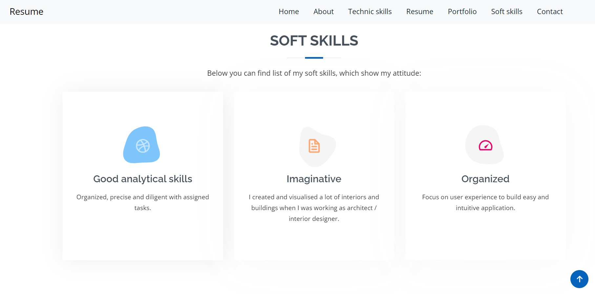
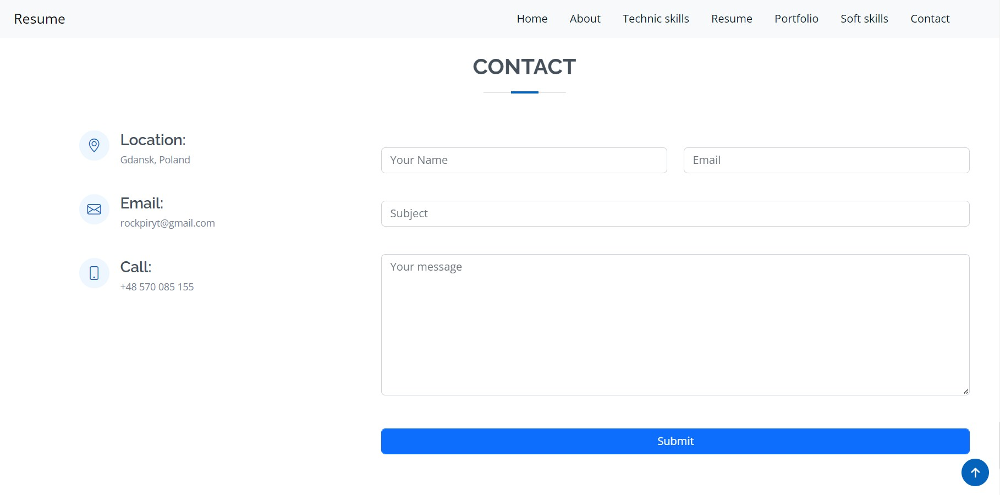

# Resume

My personal Resume with information about exeprience and technologies. There is also portfolio with my projects, which are made using Flask and Django.

## Table of Contents

* [General Info](#general-information)
* [Technologies Used](#technologies-used)
* [Features](#features)
* [Previews](#Previews)
* [Setup](#setup)
* [Project Status](#project-status)
* [Room for Improvement](#room-for-improvement)
* [Contact](#contact)
* [License](#license)

## General Information

This is Flask application to show my actual resume.  There is also contact form to send me an email. Application is prepare to deploy with AWS.

## Technologies Used

- Python - version 3.11
- Bootstrap - version 5.2.3
- Flask - version 2.2.2
- WTForms - version  3.0.1
- Twilio

## Features

List the ready features here:

- About section
- Technologies section
- Experience section
- Portfolio
- Contact form to send me email using Twilio

## Previews

### Home Page

### Section 1 - About 

### Section 2 - Technologies/languages

### Section 3 - Current learn technologies

### Section 4 - Facts

### Section 5 - Experience

### Section 6 - Portfolio

### Section 7 - Soft skills

### Section 8 - Contact form

## Setup

- Clone This Project git clone
- Enter Project Directory cd Resume
- Create a Virtual Environment (for Windows) py -m venv (name your virtual enviroment :) venv

'EXAMPLE: py -m venv venv'

- Activate Virtual Environment source: venv/Scripts/activate
- Install Requirements Package pip install -r requirements.txt
- Finally Run The Project: python app.py

## Project Status

Project is: _in progress_

## Room for Improvement

Room for improvement:

- add more information about project,
- user can download Resume in PDF file,
- deploy on AWS E2 instances,
- add dark theme,

To do:

- add previews and descriptions about projects,
- add route to download PDF file,
- change structure to deploy structure,
- add new css style to get dark theme,

## Contact

- Created by [@RockPiryt Github](https://github.com/RockPiryt)
- My Resume [@RockPiryt Resume](https://rockpiryt.github.io/Personal_Site/)

Feel free to contact me!

## License

This project is open source and available under the [MIT License]
